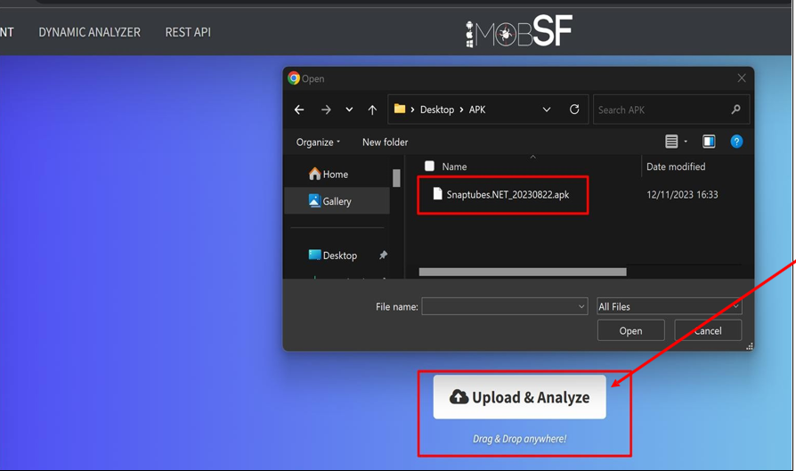
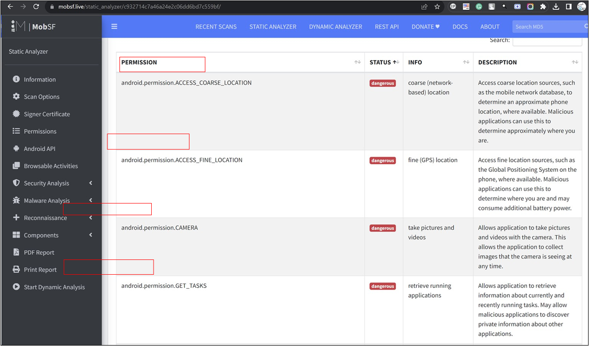
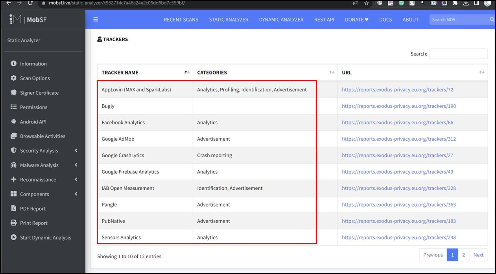
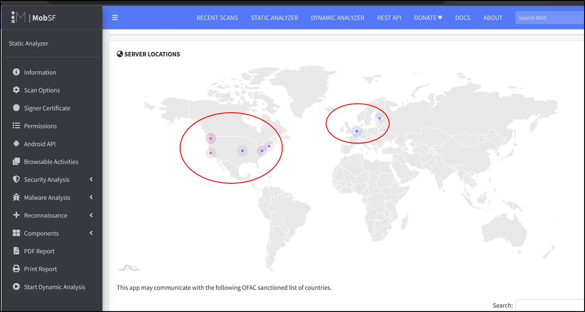

# 🔐 Mobile Application Security Investigation

## Snaptube APK Analysis using MobSF Framework

### Static • Dynamic • Tracker • Permission • Certificate Analysis

<div align="center">


<br><br>

> Mobile applications often expose more than functionality — they expose permissions, trackers, behaviors, and attack surfaces.
> This investigation demonstrates how MobSF can be used to perform professional Android application security analysis.

</div>

---

# 📌 Overview

This repository contains a complete security investigation of the **Snaptube Android APK** using the **Mobile Security Framework (MobSF)** running inside Docker on Windows.

The objective of this analysis was to:

* Perform static security assessment
* Review dangerous permissions
* Detect embedded trackers
* Analyze application components
* Inspect certificates and signing methods
* Review network/server communication patterns
* Understand overall mobile application risk posture

---

# 🧠 What is MobSF?

**MobSF (Mobile Security Framework)** is an open-source mobile application security testing framework designed for automated Android and iOS application analysis.

It helps security researchers, penetration testers, malware analysts, and developers perform:

* Static Analysis
* Dynamic Analysis
* Malware Analysis
* API Testing
* Runtime Monitoring
* Privacy Assessment

MobSF supports:

* APK / AAB (Android)
* IPA (iOS)
* APPX (Windows Mobile)

---

# ⚙️ How MobSF Works

## 🔍 Static Analysis

Static analysis is performed without executing the application.

MobSF extracts and analyzes:

* AndroidManifest.xml
* classes.dex
* permissions
* trackers
* signing certificates
* embedded URLs
* API keys
* exported components
* third-party SDKs

### Static Analysis Workflow

```text
APK Upload
    ↓
APK Extraction
    ↓
Manifest & Code Parsing
    ↓
Permission Analysis
    ↓
Tracker Detection
    ↓
Security Rule Evaluation
    ↓
Report Generation
```

### Static Analysis Helps Identify

* Dangerous permissions
* Hardcoded secrets
* Insecure configurations
* Suspicious SDKs
* Excessive exported components
* Privacy risks

---

## 🛰️ Dynamic Analysis

Dynamic analysis is performed while the application is running inside an emulator or monitored environment.

MobSF monitors:

* Runtime behavior
* API calls
* Network traffic
* File access
* SSL communication
* System interactions

### Dynamic Analysis Workflow

```text
Application Launch
        ↓
Runtime Instrumentation
        ↓
Network Monitoring
        ↓
Behavior Analysis
        ↓
Threat Observation
        ↓
Runtime Report
```

### Dynamic Analysis Helps Identify

* Live network communication
* Runtime API behavior
* SSL pinning bypass attempts
* Sensitive data leakage
* Suspicious background activity

---

# 🐳 Running MobSF using Docker

## 📋 Prerequisites

* Docker Desktop
* Windows 10/11
* WSL2 Enabled
* Minimum 4GB RAM

---

## Step 1 — Pull MobSF Docker Image

```bash
docker pull opensecurity/mobile-security-framework-mobsf:latest
```

---

## Step 2 — Run MobSF Container

```bash
docker run -it --rm -p 8000:8000 opensecurity/mobile-security-framework-mobsf:latest
```

---

## Step 3 — Access Dashboard

```text
URL: http://localhost:8000
Username: mobsf
Password: mobsf
```

---

## Step 4 — Upload APK

1. Open MobSF dashboard
2. Click “Upload & Analyze”
3. Upload APK file
4. Wait for scan completion
5. Review generated report

---

# 🕵️ Investigation Target

| Property       | Value                |
| -------------- | -------------------- |
| Application    | Snaptube             |
| Package Name   | com.snaptube.premium |
| Analysis Type  | Static + Dynamic     |
| Framework Used | MobSF                |
| Deployment     | Docker               |
| Investigator   | CyberHepisha         |

---

# 📊 Security Assessment Summary

| Category            | Observation |
| ------------------- | ----------- |
| Security Score      | 35 / 100    |
| Trackers Detected   | 12          |
| Exported Activities | 22          |
| Exported Services   | 8           |
| Exported Receivers  | 16          |
| Exported Providers  | 2           |

The analysis identified multiple areas that may impact user privacy and application security posture.

---

# ⚠️ Dangerous Permissions Identified

The application requested several high-risk permissions during analysis.

| Permission             | Risk Description                          |
| ---------------------- | ----------------------------------------- |
| ACCESS_FINE_LOCATION   | Access to precise GPS location            |
| ACCESS_COARSE_LOCATION | Access to approximate location            |
| CAMERA                 | Camera access                             |
| RECORD_AUDIO           | Microphone access                         |
| READ_CONTACTS          | Contact data access                       |
| GET_TASKS              | Access to running application information |

These permissions should always be evaluated against actual application functionality and necessity.

---

# 🧩 Tracker Analysis

MobSF identified multiple embedded analytics and advertising trackers.

| Tracker            | Category                |
| ------------------ | ----------------------- |
| AppLovin           | Advertising / Analytics |
| Facebook Analytics | Analytics               |
| Google AdMob       | Advertising             |
| Firebase Analytics | Analytics               |
| Pangle             | Advertisement           |
| Sensors Analytics  | Behavioral Analytics    |
| Bugly              | Crash Reporting         |

Trackers may collect:

* Usage analytics
* Behavioral metrics
* Device identifiers
* Advertising data

---

# 🌍 Network & Server Intelligence

The reconnaissance module identified communication endpoints associated with:

* United States
* Europe
* Asia-based infrastructure

This helps analysts understand:

* Traffic distribution
* CDN usage
* Third-party service communication
* External infrastructure exposure

---

# 📜 Certificate & Signing Review

| Finding              | Observation          |
| -------------------- | -------------------- |
| Signature Scheme     | v1 detected          |
| SHA Algorithm        | SHA1                 |
| Certificate Duration | Long validity period |
| Signing Information  | Available            |

Older signing schemes and deprecated hashing algorithms should be reviewed carefully during mobile application assessments.

---

# 🧱 Component Exposure Analysis

The APK exposed multiple Android components.

| Component  | Count |
| ---------- | ----- |
| Activities | 146   |
| Services   | 34    |
| Receivers  | 35    |
| Providers  | 11    |

Exported components increase the application attack surface and should be validated for secure implementation.

---

# 📸 Analysis Screenshots

## MobSF Dashboard



## Permission Analysis



## Tracker Detection



## Server Reconnaissance



---

# 🛠️ Tools & Environment

| Tool           | Purpose                  |
| -------------- | ------------------------ |
| MobSF          | Mobile Security Analysis |
| Docker Desktop | Container Runtime        |
| Windows 11     | Host Operating System    |
| GitHub         | Project Hosting          |
| Chrome Browser | Dashboard Access         |

---

# 📚 References

* MobSF Official Documentation
* OWASP Mobile Top 10
* Android Security Best Practices
* Docker Documentation

---

# ⚖️ Disclaimer

This project was created for:

* Educational purposes
* Security research
* Mobile application assessment learning

This repository does not promote unauthorized testing or malicious activity.

---

<div align="center">

## 👨‍💻 Author

### CyberHepisha

Chief Operating Officer & Cyber Professional • Mobile Security Research • Android Analysis 

</div>
